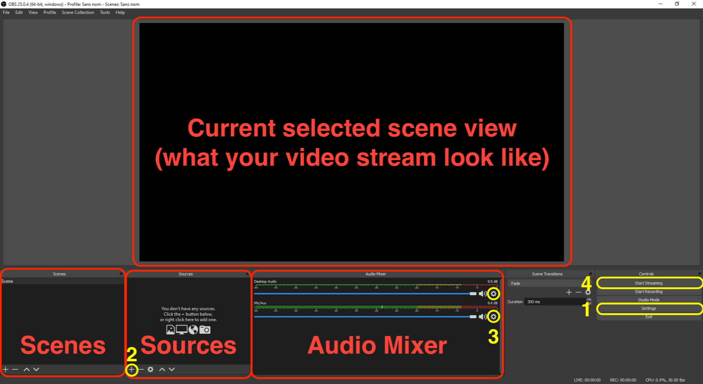

# A super fast introduction to OBS

1.  Start by downloading OBS Studio from [here](https://obsproject.com/download), then install it.

2.  Launch the application. The first time, it will prompt an automatic configuration wizard. **Skip it**. A first scene with the name "Scene" should already be created.

3. You should then see the main OBS interface:

As meant by its own name, OBS is an open broadcasting software. OBS works with **Scenes**, each scene being a patchwork of a variety of **Sources** arranged as you want. Sources can be pieces of hardware (a camera, a microphone...), files from your computer (images, video files...), virtual devices (like internal audio input/outputs) or even external live streams!

You can stream one scene at a time, and switch between scenes simply by clicking on it in the Scenes window. Several scenes can share the same audio/video sources. So you can for example have two scenes each showing a different camera, but both using the same audio source. This way you can switch from a camera to another one simply by selecting another scene.

In this guide we will only cover the simplest possible setup, including only one scene with only one video source and one audio source.

Look at the OBS interface screenshot above. In this guide we will mostly use the four yellow circled buttons:

1. The `Settings` button allows you to open the Settings panel. You can also access it through the menu bar, at `OBS > Preferences` in macOS, or `File > Settings` in Windows
2.  The ➕ button at the bottom of the Sources window allow you to create a new source.
3.  The gear icon ⚙️ nearby each source in the Audio Mixer allow you to access the source's **Properties**, the **Filters** applied to it, and the global **Advanced Audio Properties** panel allowing you some advanced tasks such as monitoring your sources.
4.  The `Start Streamingk` button, quite self-explanatory.

Notice that here we have two audio sources in the Audio Mixer ("Desktop Audio" and "Mic/Aux"). These sources does not appear in the Sources window because they are like special sources automatically created by OBS. They however act as any other audio source. You can by the way create additional similar audio sources by clicking the ➕ in the Sources window and select `Audio input capture` or `Audio output capture`. The first one acts like the "Desktop Audio" source while the latter acts like a "Mic/Aux" source.

In the next steps of this guide, you will see how to use theses features to set up a simple yet working stream for your musical performance.
